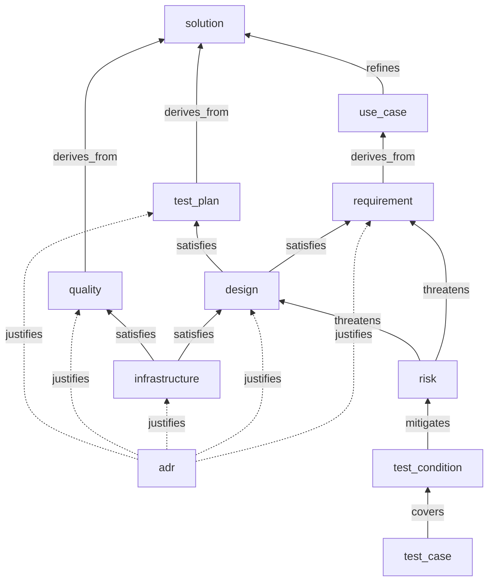
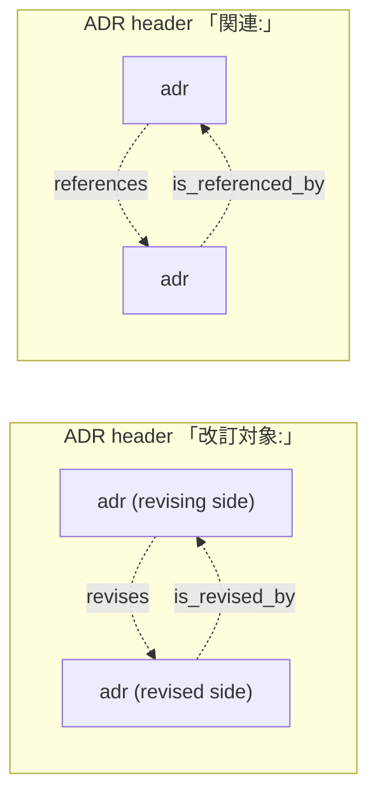

# Sara Document Graph

How to place items in this repo's sara knowledge graph (`docs/model.yaml`, validated by
`sara check`). Covers the conventions that the model schema itself cannot enforce.

## The type graph at a glance

Every type and every primary (upstream) relation `docs/model.yaml` defines, in one figure.
The YAML is the single source of truth; this figure is a hand-maintained reading aid, so a
change touching `item_types` or `allowed_targets` updates it in the same commit. Nothing
mechanical detects drift — upheld by review, like everything else in this file.

Solid arrows point from an item to its parent side; the only roots are `solution` and
`adr`. Dotted arrows are `justifies`, which ties the otherwise-independent `adr` root into
the tree (one edge minimum per ADR — an ADR without one is an orphan warning). Two
families of relations are deliberately absent from the figure: the peer `depends_on`
(`requirement`, `design`, `quality`, `test_plan` and `infrastructure` may each depend on
an item of their own type), and the downstream inverses (`is_refined_by`, `derives`, …),
which mirror the primary direction one-to-one.

ADR-to-ADR peer relations are drawn separately. Both correspond to a header line in the
ADR document (see `docs/adr/README.md`):

## Where a norm belongs: `requirement`, `quality` or `test_plan`

Three types carry a `specification` / `specification_ja` pair and hang off the spec side of
the graph: `requirement` (under a `use_case`), `quality` (under the `solution`) and
`test_plan` (under the `solution`). Nothing mechanical tells them apart. A wrong parent of
the right shape is indistinguishable from a right one, so an item placed in the wrong type
still passes `sara check`; and the RFC2119 check offers no help either, since sara applies
it to any non-empty `specification` whatever the type holding it (`validate_item_metadata`
branches on the field, not on `item_type` — verified against sara 0.9.4 by stripping the
SHALL from a `test_plan` and watching the check fail). The choice is therefore a judgement
call, made by the rule below and upheld by review alone.

> Ask **who the norm binds**. A norm binding the product as the user meets it is a
> `requirement`. A norm binding the people and the process that build the product is a
> `quality`. A norm binding what and how we test is a `test_plan`.

Stated as a discriminator per type:

| Type | The norm binds | Parent | Signature test |
|---|---|---|---|
| `requirement` | The product's behaviour and contracts. Observable by a user who never reads this repo. | `use_case` | Some way of *using* nput would change if it were dropped. |
| `quality` | The development process, conventions and governance. Cuts across the work rather than attaching to a feature, and is not itself about verifying anything. | `solution` | Only contributors would notice it being dropped; the shipped artifact is unchanged, and no verification is lost. |
| `test_plan` | The scope, levels and approach of testing, including access to what is under test. | `solution` | The reason it exists at all is that something has to be verified. |

The two `solution`-level types overlap on the contributor test — dropping either is
invisible to a user — so run the `test_plan` question first. If the item exists because
something has to be verified, it is a `test_plan`; `quality` is what remains.

Examples: exit-code meanings, the field layout of `manifest.json` and stopping on a
conflict are `requirement`. "Write `specification` in English", "run `flake check` on every
platform in CI" are `quality`. The scope of the E2E harness, a declaration that something
is out of scope *for testing*, and securing testability are `test_plan`.

### Grey zones

The rule above decides most items on its own. The cases where it does not are these; the
precedents settle them so that parallel lanes do not diverge.

**An API surface opened for testing.** `TP-403c55c7` (`lib.__internal`, formerly
`REQ-901993e9`) was settled as `test_plan` in Issue #239. It is a real attrset the product
exposes, so it reads as a contract, but its only motive is to let evaluation tests reach
private helpers, and its `specification` spends its SHALL NOTs *excluding* the surface from
stability and backward compatibility. Where a surface exists solely so that something can
be tested, and disclaims the guarantees a contract would carry, testability dominates and
the item is a `test_plan`.

**A norm about how nput is built.** Constraints such as "the engine is stdlib-only", "the
CLI's third-party dependencies are limited to cobra and pinned by vendorHash", "`lib`
depends on nixpkgs.lib alone" look like process rules, but they stay `requirement`. They
are architectural boundaries the user meets: `lib` depending on nixpkgs.lib alone is what
lets a user import it into any Nix environment without dragging in home-manager. The
discriminator is the signature test — drop the norm and a way of using nput changes. A
genuine `quality` counterpart would be a rule about *how the repo works* (a review
convention, a CI obligation) that no consumer can observe.

**A declaration that something is out of scope.** Ask *whose* scope. A declaration that the
product will not offer something — "no `--only` flag", "no cleanup command in the MVP",
"aiming two configs at one target is the user's responsibility" — is a `requirement`: it
delimits what a user can do, and a user meets the absence directly. A declaration that
something will not be *verified* — `TP-b7f1dc79`, which puts actually activating the
NixOS / nix-darwin module paths outside the E2E harness — is a `test_plan`: the product
still offers the thing, only the testing stops short of it.

**A norm about error and warning output.** "An error carries a line of remediation
guidance", "success is silent by default", "warnings go to stderr while stdout is reserved
for machine-readable output" are all `requirement`, whether they bind the wording, the
stream or the verbosity level. Output is part of the CLI's observable behaviour, and a user
— or a pipe — meets it directly. It would be a `quality` only if it were a repo-wide writing
convention that no single command's contract depended on.

**A version or compatibility policy.** "`schemaVersion` is fixed at 1", "the MVP emits and
accepts v1 only and builds no migration mechanism" are `requirement`. They bind the
contract a consumer of `manifest.json` reads, and the second additionally binds what the
engine accepts at run time. A policy that only told contributors when they may bump a
version — without changing what the product emits or accepts — would be `quality`.

**A norm about a nix-level workflow.** These are `requirement` whenever the workflow they
bind is the *consumer's*. "`nix flake check` warns `unknown flake output` and this is
accepted; primary verification is `nix build`" binds what the consumer's own flake emits —
a property of the output namespace nput asks users to adopt. "A flake entrypoint evaluates
purely and a legacy one may evaluate impurely at the user's own risk" and
"`experimental-features` is a precondition the CLI will not paper over" bind what the
consumer's nix environment must supply for nput to work at all. Had any of them been a rule
about this repository's own CI, it would be `quality` (or `infrastructure`, if it were about
the pipeline that runs it rather than the norm it upholds).

### `quality` versus `infrastructure`

`quality` holds the norm; `infrastructure` holds the machinery that upholds it. "Every
platform's `flake check` passes before merge" is a `quality`; the CI pipeline that runs it
is an `infrastructure`. When in doubt, ask whether the item would still hold if the tooling
were replaced — if so, it is the norm.

## Where a risk attaches: `requirement` or `design`

A `risk` may point at a `requirement` or a `design` via `threatens`. The model permits
both, and constrains neither the count nor the mix, so the choice is a judgement call —
make it by this rule.

> A risk attaches to `requirement` by default. Attach it to `design` only when it is a
> risk that **would disappear if the design were replaced by an alternative** — that is, a
> risk intrinsic to the design choice. A concern that the requirement itself might not be
> met always attaches to `requirement`.

The test: imagine the design being swapped for a different one that satisfies the same
requirement. If the risk goes away with it, it belongs to the design. If it survives the
swap, it belongs to the requirement.

Apply the test once per `threatens` edge, not once per risk. A risk that names several
facets of one threat may hold edges of both kinds at once — the facets that survive the
swap to `requirement`, the facet intrinsic to the design to `design` — and the design-side
example below is exactly that shape. What the rule forbids is an edge whose kind the test
does not support, not a risk that earns more than one.

Examples:

| Risk | Attaches to | Why |
|---|---|---|
| The semantics of root resolution and placement diverge per entrypoint form (`RISK-e916f742` → `DSG-92f54490`) | `design` | Confining the legacy branch to the attr path assembly is one design for "one implementation across entrypoint forms". Replace it — e.g. write each entrypoint's nix invocation out separately — and this particular divergence is gone. |
| `apply` leaves traces on the filesystem when it fails | `requirement` | This is the requirement itself being broken. Every design has to answer for it; no change of design makes the concern go away. |

Attaching a design-specific risk to the requirement loses the information that the risk is
a cost of one particular choice. Attaching a requirement-level risk to a design hides it
from every other design that has the same exposure.

## Why this matters

Risks are where test conditions hang from (`test_condition --mitigates--> risk`), so
misplacing a risk misplaces the tests that cover it. A requirement-level risk parked under
one design leaves the other designs looking untested for a concern they share.

## How a risk is scored: `likelihood`, `impact` and `level`

`docs/model.yaml` requires all three on every `risk` and constrains each to
`high` / `medium` / `low`, but the enum alone says nothing about how to choose a value.
Left unstated, parallel lanes invent their own scales and the corpus stops ranking
anything — which is the same reason the `specification` and `threatens` conventions live
in this file. The rules below fix the scale; `level` is then derived, not judged.

### `likelihood` — how easily a regression that realises the threat gets in

Judge it as "how often the code in question changes" × "how far the existing verification
gates would miss the regression". Code that changes frequently and sits in a blind spot of
the test suite is `high`; stable code already covered by a mechanical check is `low`.

### `impact` — how recoverable it is once realised

| Value | What is at stake |
|---|---|
| `high` | Destroys the user's environment or real data, or leaves a silent inconsistency. |
| `medium` | Misbehaves, but a re-run or a rebuild recovers it. |
| `low` | Confined to development; never reaches the shipped artifact. |

Read the rows top-down and take the first that fits: a threat that stays inside development
but passes silently — a verification gate that reports success while checking nothing — is
`high` on the silent-inconsistency clause, not `low` on the confinement clause. What makes
it `high` is that nothing announces the loss, and confinement to development does not
supply the announcement.

### `level` — derived from the two, never judged by hand

| `likelihood` \ `impact` | `high` | `medium` | `low` |
|---|---|---|---|
| **`high`** | `high` | `high` | `medium` |
| **`medium`** | `high` | `medium` | `low` |
| **`low`** | `medium` | `low` | `low` |

Nothing mechanical checks the derivation today — `sara check` validates the enum, not the
relation between the three fields — so it is upheld by review like the rest of this file.
Unlike the rest of this file, though, it need not stay that way: the rule is a pure mapping
over three frontmatter fields with no prose to interpret, so it is the one convention here
that a script can decide outright. Reviewing it by eye is the weakest form of the check,
and a repository-level check in the shape of `dev/tests/sara-id.sh` would replace it
wholesale. Until such a check exists, verify the cell when touching any of the three fields.

A `level` that does not match the cell is a defect in the item, not a considered override:
if the matrix feels wrong for an item, the mis-scored field is `likelihood` or `impact`.

## How an item states its norm: `specification` / `specification_ja`

The three types of the section above — `requirement`, `quality` and `test_plan` — each
carry their norm twice: `specification` in English (which sara validates for the presence
of an RFC2119 keyword, whatever the type) and `specification_ja` in Japanese (which sara
does not inspect at all). Both are normative; neither is a translation gloss of the other.
The rules below apply to all three and keep the two fields readable as one norm.

Nothing enforces them mechanically. sara only asks whether *some* RFC2119 keyword is
present, never which spelling, and it does not look at `specification_ja` at all. These
rules are therefore upheld by review. Should that prove too loose, the check belongs in a
prose linter built for the job (textlint and the like) rather than in a hand-rolled script.

### `specification` uses the SHALL family only

Write `SHALL` / `SHALL NOT`. Do not write `MUST` / `MUST NOT`, even though RFC2119 makes
them synonyms — mixing both spellings for one strength makes the corpus read as if the two
differ. `SHOULD` / `SHOULD NOT` / `MAY` stay as they are; they carry strengths of their own.
The `placeholder` in `docs/model.yaml` uses SHALL for the same reason.

### `specification_ja` uses normative auxiliaries, not the plain declarative

A sentence that states the norm must end in a normative auxiliary. The plain declarative
("〜する", "〜となる") reads as a description of the current implementation rather than as a
demand on it, which is exactly the distinction the item exists to record.

This applies per sentence, not per item: within one `specification_ja`, the sentences that
state the norm take an auxiliary, while sentences that supply background, rationale, or a
worked example stay in the declarative. Do not force an auxiliary onto a sentence that is
not itself normative.

### The strength mapping is fixed

| `specification` | `specification_ja` |
|---|---|
| SHALL (= MUST) | 〜しなければならない |
| SHALL NOT (= MUST NOT) | 〜してはならない |
| SHOULD / SHOULD NOT | 〜すべきである / 〜すべきでない |
| MAY | 〜してもよい |

Inflected forms of these are fine where the sentence needs them (e.g. 「〜してはならず、」 to
join a following clause), as long as the strength is unchanged. What must not happen is a
strength drifting across the two fields — a `SHALL` rendered as 「〜すべきである」 weakens the
norm in the field most readers of this repo actually read.
